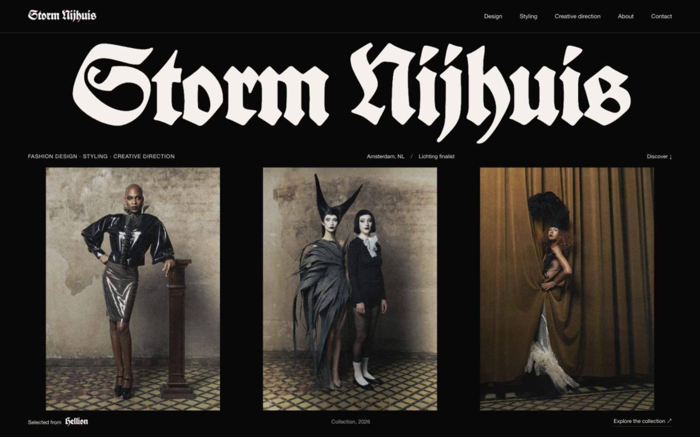

# Storm Nijhuis

A black editorial portfolio for Storm Nijhuis: fashion design, styling, creative direction, About and Contact. Built with vanilla JavaScript and Vite, with all pages pre-rendered to static HTML.



## Run

Use Node.js 22.12+ or 24 and pnpm.

```sh
pnpm install
pnpm dev
pnpm build
pnpm preview
```

Deploy the generated `dist/` directory to a static host at the domain root. Each route has its own `index.html`, including nested collection pages. `404.html` is also generated. No server or backend is required. The source metadata has no invented production domain; set the canonical URL and absolute Open Graph image when hosting is chosen.

## Content

Edit `src/content.js` for project groupings, film status, contact details and page metadata. Edit `src/templates.js` for page copy and composition. `public/assets/manifest.json` records the source filename, hash, dimensions and responsive derivatives for each of the 149 supplied photographs.

- All 36 Hellion lookbook photographs are included in ordered groups of four.
- All 45 Hellion editorial, 28 Anima Obscura and 15 styling photographs are available in their project galleries.
- Photographs have no filters or forced cover crops. Portrait and landscape archives are grouped separately.
- The supplied Koch=Schrift webfont is used for Storm and Hellion. Helvetica Neue/Arial is the sans-serif fallback until an RB Campton Neue webfont is supplied.
- The CV is public. Film reels, treatment, research, original TIFFs and private source documents are excluded.

## Releasing the film

Keep `film.embedUrl` as `null` until public release. After the premiere, set it to the public YouTube embed URL and set `film.status` to `Released` in `src/content.js`. Update the film copy and metadata at the same time. Do not place prerelease video files in `public/`.

## Checks and accessibility

`pnpm build` runs content and asset checks, then builds all eight pages. Native anchors, semantic headings, a mobile menu, roving keyboard tabs, dialog focus management, swipe navigation, alt text, a skip link and reduced-motion support are included. Detailed content decisions and the few items to confirm are in `docs/design-notes.md`.
