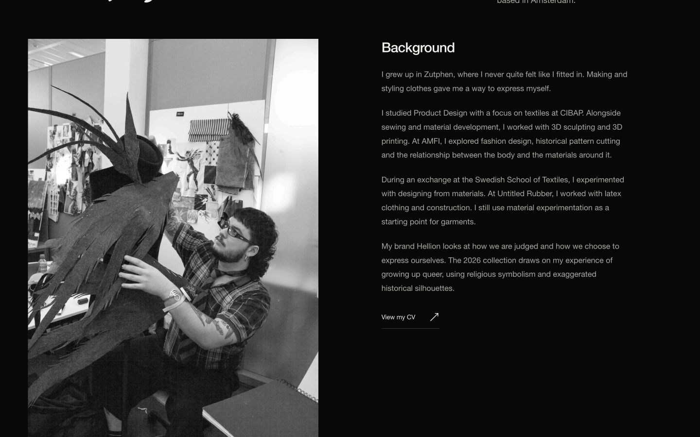
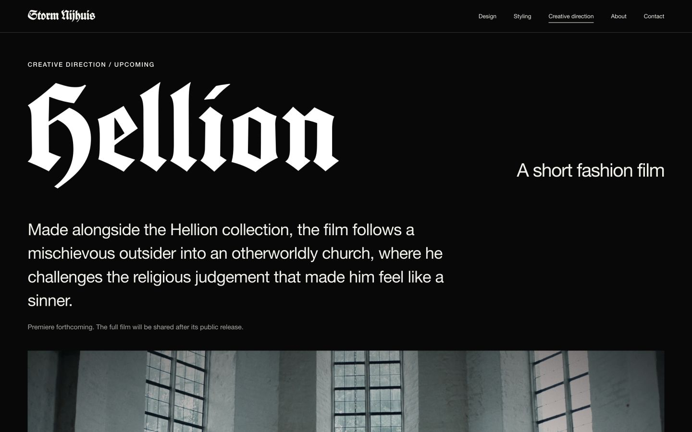

# Storm Nijhuis

**Fashion design · Styling · Creative direction**

A personal portfolio for Storm Nijhuis, an Amsterdam-based fashion designer, stylist and creative director. The site brings together the **Hellion** collection, **Anima Obscura**, styling work and an upcoming short fashion film.

The visual language follows the work: a black editorial canvas, oversized Koch=Schrift typography and generous space for photography. Images retain their original colours and full compositions, from sculptural garment silhouettes to film stills.

Built with **vanilla JavaScript, CSS and Vite**, with eight portfolio pages and five information pages pre-rendered to static HTML.


[Get started](#get-started) · [Explore the site](#explore-the-site) · [Edit content](#edit-content) · [Build and deploy](#build-and-deploy) · [Validation](#validation)

## Explore the site

| Route | What you will find |
| --- | --- |
| `/` | Personal introduction and selected design, styling and film work. |
| `/design/` | An overview of Hellion and Anima Obscura. |
| `/design/hellion/` | The 2026 collection, a seven-look lookbook, editorial archive and presentation photographs. |
| `/design/anima-obscura/` | A fashion editorial made with Denise Bakker, its photographic archive and project credits. |
| `/styling/` | Styling assistance during the Annet Veerbeek internship, presented as one gallery. |
| `/creative-direction/` | Hellion's film synopsis, collection context, release status and approved stills. |
| `/about/` | Background, education, experience and a downloadable CV. |
| `/contact/` | Direct email, telephone, Instagram and CV links. |
| `/privacy/` | Enquiry and hosting data, providers, retention and privacy rights. |
| `/legal/` | Business identification and contact information. |
| `/cookies/` | Browser storage, hosting security and external services. |
| `/accessibility/` | Accessibility features, keyboard controls, limitations and help. |
| `/terms/` | Enquiries, commission agreements and consumer cancellation information. |

The galleries include a full-screen photograph viewer with arrow-key navigation, swipe gestures and drag-down dismissal. The Hellion lookbook lets visitors move between seven looks, each with four views. Expandable archives keep complete photographic series accessible alongside the featured selections.

<details>
<summary>More screenshots</summary>

### About



### Hellion film



</details>

## Get started

Use **Node.js 22.12+** and **pnpm**. Build scripts use ES modules and JSON import attributes.

```sh
git clone https://github.com/yeg-bearlover/storm-new.git
cd storm-new
pnpm install --frozen-lockfile
pnpm dev
```

Open the URL printed by Vite, normally `http://127.0.0.1:5173`. The development server binds to the local loopback address.

The project runs without environment variables or service credentials. Dependencies are recorded in `pnpm-lock.yaml`; `pnpm-workspace.yaml` permits esbuild's installation script.

### Commands

| Command | Purpose |
| --- | --- |
| `pnpm dev` | Start Vite with live updates while editing. |
| `pnpm check` | Validate content, image references, internal links and editorial rules. |
| `pnpm check:publication` | Report missing business and privacy details before publishing final notices. |
| `pnpm build` | Run validation, bundle the site and pre-render every page into `dist/`. |
| `pnpm preview` | Serve the existing production build locally, normally on port `4173`. |

Build before running `pnpm preview`.

## How it works

The same page templates serve development, production HTML generation and client-side navigation.

1. **Content** comes from `src/content.js` and the image manifest in `public/assets/manifest.json`.
2. **Templates** in `src/templates.js` turn that content into page HTML, shared navigation, galleries and metadata.
3. **Browser interactions** in `src/main.js` add the mobile menu, lookbook tabs, photograph viewer, page transitions and history navigation.
4. **Production generation** in `scripts/build.mjs` runs Vite, then writes rendered markup and route-specific metadata into each page's HTML file.

Direct visits to nested routes receive pre-rendered content. In the browser, internal navigation uses the History API and rebinds page interactions. View transitions are used when supported and reduced motion is not requested.

### Project structure

```text
storm-new/
├── index.html                  # HTML shell, shared head tags and skip link
├── src/
│   ├── content.js              # Project groups, biography, film, contact and routes
│   ├── templates.js            # Page markup, image descriptions and metadata
│   ├── main.js                 # Navigation, galleries, viewer and motion
│   └── styles.css              # Typography, layout, responsive rules and motion
├── public/
│   ├── favicon.svg
│   └── assets/                 # WebP images, manifest, logo, webfont and public CV
├── scripts/
│   ├── validate.mjs            # Content and asset assertions
│   └── build.mjs               # Vite build and static page generation
├── docs/
│   ├── design-notes.md         # Editorial decisions and details to confirm
│   └── preview-*.png           # Saved interface screenshots
├── package.json
├── pnpm-lock.yaml
└── pnpm-workspace.yaml
```

## Edit content

| Change | Where to edit |
| --- | --- |
| Homepage biography | `homeBiography` in `src/content.js` |
| Project groups and lookbook selection | Group exports and `looks` in `src/content.js` |
| Film synopsis, still order and release status | `film` in `src/content.js` |
| Email, telephone and Instagram | `contact` in `src/content.js` |
| Business identification, retention and privacy confirmations | `src/legal.js` and [legal publication notes](docs/legal-publication.md) |
| Page titles and descriptions | `routes` in `src/content.js` |
| Page copy, credits, featured images and composition | `src/templates.js` |
| Image alt text and viewer descriptions | `imageDescriptions` and `description()` in `src/templates.js` |
| Typography, spacing, colours and motion | `src/styles.css` |
| Downloadable CV | `public/assets/storm-nijhuis-cv.pdf` |

To add a page, register its metadata in `routes` in `src/content.js`, add its renderer to the `pages` map in `src/templates.js` and add navigation links where appropriate. The build picks up registered routes automatically. Update relevant validation assertions when the content changes.

### Photography and assets

The manifest tracks **149 source photographs**, each with a `small` and `large` WebP derivative. Entries record the original filename, SHA-256 hash, source dimensions and derivative paths and dimensions. `picture()` generates responsive `srcset` markup, explicit image dimensions and alt text; images are lazy-loaded unless marked eager.

The current selections are intentional:

- **Hellion lookbook:** 28 photographs across seven displayed looks, numbered `01–07`. These retain source sets `01–05`, `07` and `09`; source sets `06` and `08` remain omitted from the lookbook. All 36 source lookbook entries remain in the manifest.
- **Hellion editorial:** 45 photographs across the two supplied series.
- **Anima Obscura:** 28 photographs.
- **Styling:** 15 photographs in the Annet Veerbeek internship gallery.
- **Film:** all 13 approved stills.

Preserve complete frames and image proportions when changing layouts. Portrait and landscape archives are grouped separately; CSS filters and forced `object-fit: cover` crops are rejected by validation.

Image derivatives are already supplied. The repository does not include an image-processing command: when adding photography, prepare both WebP sizes, add a manifest entry and update the relevant content group and description. The build copies everything in `public/` into the published output, so that directory should contain only approved public material.

### Release the film

Hellion is currently marked `Upcoming`, with `film.embedUrl` set to `null`. The page presents approved stills while the film awaits public release.

Once the premiere and public release are confirmed:

1. Confirm the privacy and consent requirements for the public YouTube **embed** URL before setting `film.embedUrl` and changing `film.status` to `Released` in `src/content.js`.
2. Review the synopsis, release copy and route description in `src/content.js`, plus the film image descriptions in `src/templates.js`.
3. Update `scripts/validate.mjs`: it currently requires a null embed URL and rejects `<video>` and `<iframe>` markup on every route. Adapt those checks to permit the approved player on the film page while preserving the restrictions elsewhere.
4. Run `pnpm build`, then inspect the film page with `pnpm preview` before publishing.

Unreleased footage, reels, treatments, research documents and original TIFF masters stay outside `public/`.

## Build and deploy

```sh
pnpm build
pnpm preview
```

**Use `pnpm build` for production.** Running Vite's build command directly skips the repository's validation and static page generation.

The build produces thirteen website pages, a `/404/index.html` page and a root `404.html`, alongside the bundled JavaScript, CSS and public assets:

```text
dist/
├── index.html
├── design/
│   ├── index.html
│   ├── hellion/index.html
│   └── anima-obscura/index.html
├── styling/index.html
├── creative-direction/index.html
├── about/index.html
├── contact/index.html
├── privacy/index.html
├── legal/index.html
├── cookies/index.html
├── accessibility/index.html
├── terms/index.html
├── 404/index.html
├── 404.html
├── assets/
└── favicon.svg
```

Deploy `dist/` to a static host with these settings:

| Setting | Value |
| --- | --- |
| Install command | `pnpm install --frozen-lockfile` |
| Build command | `pnpm build` |
| Output directory | `dist` |
| URL base | Domain root (`/`) |

Configure the host to serve each route's directory index and use `404.html` for unknown paths with an HTTP 404 status. Directly opening or refreshing `/design/hellion/` should serve that page's generated HTML.

Vercel deploys the GitHub repository using `vercel.json`, which sets the build command, output directory and response headers. The Content Security Policy permits local assets and blocks external scripts, connections and embedded players. If an optional external service is introduced, review its privacy requirements before changing that policy. Before publishing final legal notices, complete `src/legal.js` and run `pnpm check:publication`; see [legal publication notes](docs/legal-publication.md).

Asset and navigation URLs are root-relative, so deployment beneath a subdirectory requires changes to URL handling. Once a production domain is chosen, add per-page canonical URLs, `og:url` and an absolute `og:image` through `index.html` and `scripts/build.mjs`. Titles and descriptions are already generated per route.

## Validation

`pnpm check` runs the repository's content and asset assertions. `pnpm build` runs the same checks before generating the site. They verify:

- Lookbook selection, consecutive displayed numbering and four views per look.
- Expected gallery counts and inclusion of every approved film still.
- Existence and aspect ratios of both image derivatives.
- Valid internal links, viewer image references and one main heading per route.
- Selected homepage, About and film images, plus specific editorial copy decisions.
- The current restriction on unreleased playback and selected private-source file types.
- Reduced-motion styles and the absence of filters and forced cover crops.

Some assertions deliberately lock in approved content. When changing a selection or release state, review and update its corresponding assertions. These checks do not replace browser testing or a review of the files being published.

### Interaction checks before publishing

After `pnpm build`, use `pnpm preview` to check direct route visits and refreshes, browser back/forward navigation, the mobile menu, lookbook tabs and photograph galleries. Confirm that the CV and contact links resolve.

Keyboard controls include:

| Context | Controls |
| --- | --- |
| Lookbook tabs | Left/right arrows select adjacent looks; `Home` and `End` select the first and last. |
| Photograph viewer | Left/right arrows browse; `Esc` closes and returns focus to the triggering photograph. |
| Mobile menu | `Esc` closes and returns focus to the menu button. |

Accessibility support includes semantic headings, a skip link, visible focus styles, a native modal dialog and `prefers-reduced-motion` handling.

## Design notes and credits

[Design notes](docs/design-notes.md) document the photographic selections, motion rules, content decisions and details still awaiting confirmation, including film credits and styling dates.

The supplied **Koch=Schrift** webfont provides the signature display typography. Body and interface text use Helvetica Neue, Helvetica and Arial fallbacks; RB Campton Neue has not been supplied. Project credits are recorded in the page templates and design notes.

There is currently no `LICENSE` file in this repository. No open-source or media reuse licence is specified.
